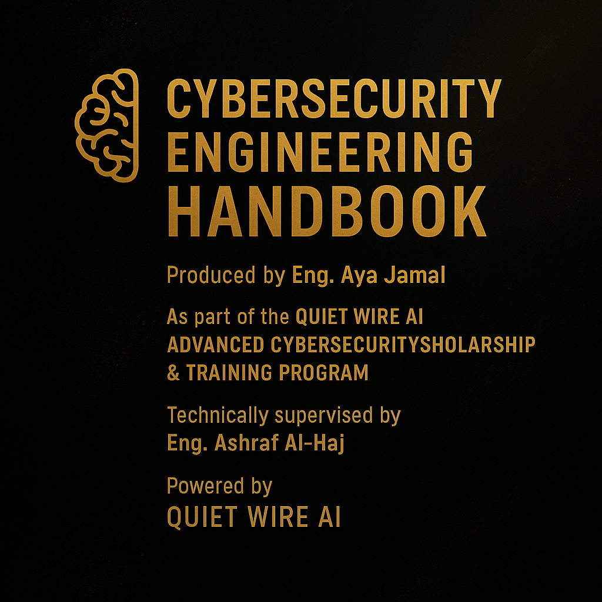

  

---

<h1 align="center">🔐 Cybersecurity Multi-Language Handbook</h1>
<h3 align="center">Created by Eng. Aya Jamal — Quiet Wire AI Scholarship Trainee</h3>
<h4 align="center">Under the Official Training & Technical Supervision of Quiet Wire AI</h4>
<h4 align="center">With the Assistance of Aletheia (AI Teammate) 🤖✨</h4>

---

## ✨ About This Project

This handbook is produced as part of the **Quiet Wire AI Advanced Cybersecurity Scholarship & Training Program**.  
It demonstrates structured documentation, multi-language educational work, and professional cybersecurity research standards.

### 🔗 Official Quiet Wire AI Website  
https://www.quietwire.ai/

---

## 🌟 Key Highlights

- ✔ Produced under **Quiet Wire AI training & supervision**  
- ✔ Multi-language cybersecurity handbook  
- ✔ Professionally structured repository  
- ✔ High-quality PDFs for AR / EN / FR / ES  
- ✔ Clean educational formatting  
- ✔ Suitable for students, engineers, and cybersecurity learners  

---

## 📁 Repository Structure

📁 Arabic/ └── cybersecurity_handbook_AR.pdf └── README_AR.md

📁 English/ └── cybersecurity_handbook_EN.pdf └── README_EN.md

📁 French/ └── cybersecurity_handbook_FR.pdf └── README_FR.md

📁 Spanish/ └── cybersecurity_handbook_ES.pdf └── README_ES.md

---

## 🌍 PDF Downloads (Multi-Language)

| Language | Folder | PDF Link |
|----------|--------|-----------|
| 🇸🇦 Arabic | [Arabic/](Arabic/) | [Download PDF](Arabic/cybersecurity%20handbook%20_AR%20(1).pdf) |
| 🇬🇧 English | [English/](English/) | [Download PDF](English/cybersecurity%20handbook%20EN.pdf) |
| 🇫🇷 French | [French/](French/) | [Download PDF](French/cybersecurity%20handbook%20FR.pdf) |
| 🇪🇸 Spanish | [Spanish/](Spanish/) | [Download PDF](Spanish/cybersecurity%20handbook%20ES.pdf) |

---

## 📘 Direct PDF Downloads

- 🇸🇦 **Arabic Version** → [Download](Arabic/cybersecurity%20handbook%20_AR%20(1).pdf)  
- 🇬🇧 **English Version** → [Download](English/cybersecurity%20handbook%20EN.pdf)  
- 🇫🇷 **French Version** → [Download](French/cybersecurity%20handbook%20FR.pdf)  
- 🇪🇸 **Spanish Version** → [Download](Spanish/cybersecurity%20handbook%20ES.pdf)  

---

## 🧠 Credits

- **Main Author:** Eng. Aya Jamal  
- **Technical Supervisor:** Eng. Ashraf Al-Haj  
- **Training Organization:** Quiet Wire AI  
- **AI Assistant:** Aletheia 🤖✨  

---

## 🏢 About Quiet Wire AI

**Quiet Wire AI** specializes in:

- Cybersecurity Research  
- Offensive & Defensive Security  
- AI-Powered Security Solutions  
- Professional Training & Scholarship Tracks  

🔗 For more information:  
**https://www.quietwire.ai/**

---

## 🎯 Quiet Wire AI — Mission & Vision

### 🌐 Mission  
To empower the next generation of engineers through advanced cybersecurity education, AI-driven security solutions, and hands-on professional training aligned with global standards.

### ✨ Vision  
To become a leading global center for cybersecurity research, innovation, and talent development — building highly skilled engineers capable of defending and shaping the digital future.

---

## 🛡️ Quiet Wire AI — Cybersecurity Training Track

This handbook is developed under the **Quiet Wire AI Cybersecurity Training Track**, focusing on:

- 📘 Structured cybersecurity foundation  
- 🧠 Advanced theoretical & practical learning  
- 🧪 Hands-on labs & real-world scenarios  
- 🛡️ Defensive & offensive security  
- 🤖 AI integration in cybersecurity  
- 🏗 Professional documentation & engineering writing  
- 🌍 Multi-language technical publishing  

This track aims to build engineers who can:

- Analyze threats  
- Understand attack mechanisms  
- Design secure architectures  
- Document professionally  
- Produce work matching real cybersecurity companies  

---

  ✨ <b>Quiet Wire AI — Cybersecurity & Research Excellence</b> ✨

