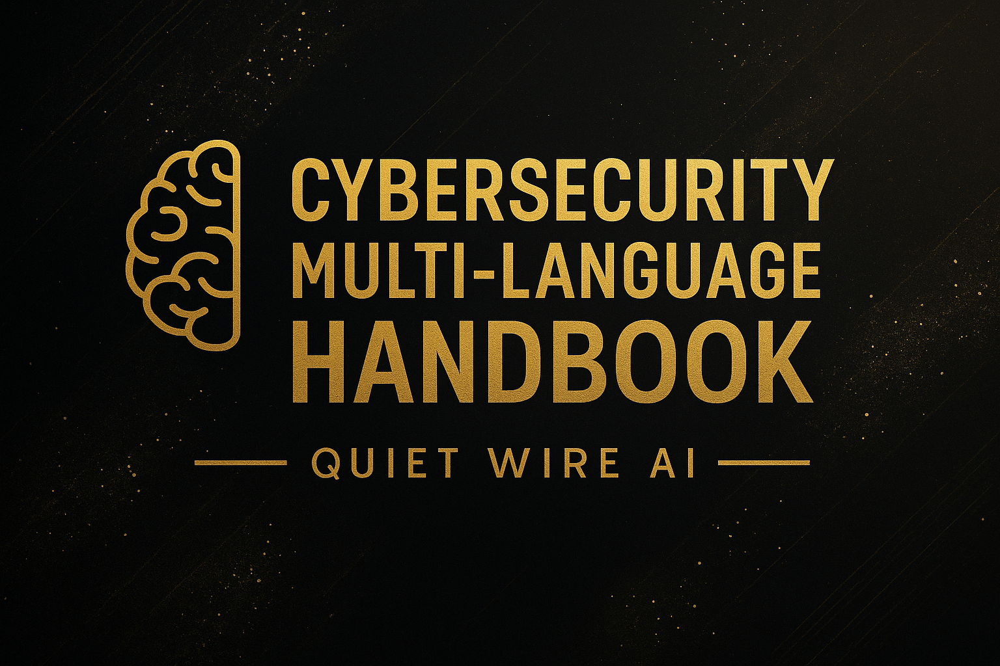

# 🔐 Cybersecurity Multi-Language Handbook

**By Eng. Aya Jamal — Quiet Wire AI**  
Under the supervision of **Eng. Ashraf Al-Haj 👨‍🏫**  
With the assistance of **Aletheia (AI Teammate) 🤖✨**

---

## 🌟 Key Highlights
- ✔️ Premium multi-language cybersecurity handbook  
- ✔️ Organized in professional, clean folder structure  
- ✔️ High-quality PDFs for each language  
- ✔️ Modern, company-grade documentation style  
- ✔️ Designed for students, engineers, and cybersecurity learners  

---

## 🚀 Overview
This repository presents a **professional, multi-language cybersecurity handbook** created as a reference for:

- Students  
- Engineers  
- Cybersecurity beginners  
- Offensive & defensive security learners  

It provides **clear, structured, practical** cybersecurity knowledge in **4 languages**:

- 🇸🇦 Arabic  
- 🇬🇧 English  
- 🇫🇷 French  
- 🇪🇸 Spanish  

---

## 📁 Repository Structure
Each language has its own dedicated folder and README file:

- 📂 **Arabic/** → `README_AR.md`  
- 📂 **English/** → `README_EN.md`  
- 📂 **French/** → `README_FR.md`  
- 📂 **Spanish/** → `README_ES.md`  

PDF versions are included for all languages:
- 📘 `cybersecurity_handbook_AR.pdf`  
- 📘 `cybersecurity_handbook_EN.pdf`  
- 📘 `cybersecurity_handbook_FR.pdf`  
- 📘 `cybersecurity_handbook_ES.pdf`  

---

## 🌍 Available Languages & PDF Downloads

| Language | Folder | PDF Link |
|---------|--------|----------|
| 🇸🇦 **Arabic** | [Arabic/](Arabic/) | [Download PDF](https://github.com/ayaxor/Aya_Cybersecurity_English_-Learning-/blob/main/Arabic%2FCybersecurity%20handbook%20_AR%20(1).pdf) |
| 🇬🇧 **English** | [English/](English/) | [Download PDF](https://github.com/ayaxor/Aya_Cybersecurity_English_-Learning-/blob/main/English%2Fcybersecurity%20handbook%20EN.pdf) |
| 🇫🇷 **French** | [French/](French/) | [Download PDF](https://github.com/ayaxor/Aya_Cybersecurity_English_-Learning-/blob/main/French%2Fcybersecurity%20handbook%20FR.pdf) |
| 🇪🇸 **Spanish** | [Spanish/](Spanish/) | [Download PDF](https://github.com/ayaxor/Aya_Cybersecurity_English_-Learning-/blob/main/Spanish%2Fcybersecurity%20handbook%20ES.pdf) |

---

## 📚 Download Handbook (All Languages)

- 🇸🇦 **Arabic Version** → ⬇️ [Download Arabic PDF](https://github.com/ayaxor/Aya_Cybersecurity_English_-Learning-/blob/main/Arabic%2FCybersecurity%20handbook%20_AR%20(1).pdf)  
- 🇬🇧 **English Version** → ⬇️ [Download English PDF](https://github.com/ayaxor/Aya_Cybersecurity_English_-Learning-/blob/main/English%2Fcybersecurity%20handbook%20EN.pdf)  
- 🇫🇷 **French Version** → ⬇️ [Download French PDF](https://github.com/ayaxor/Aya_Cybersecurity_English_-Learning-/blob/main/French%2Fcybersecurity%20handbook%20FR.pdf)  
- 🇪🇸 **Spanish Version** → ⬇️ [Download Spanish PDF](https://github.com/ayaxor/Aya_Cybersecurity_English_-Learning-/blob/main/Spanish%2Fcybersecurity%20handbook%20ES.pdf)  

---

## 🧠 Credits
- **Main Author:** Eng. Aya Jamal  
- **Supervisor:** Eng. Ashraf Al-Haj  
- **AI Assistant:** Aletheia 🤖✨  

---

## ✨ Quiet Wire AI — Premium Cybersecurity & Research Excellence ✨